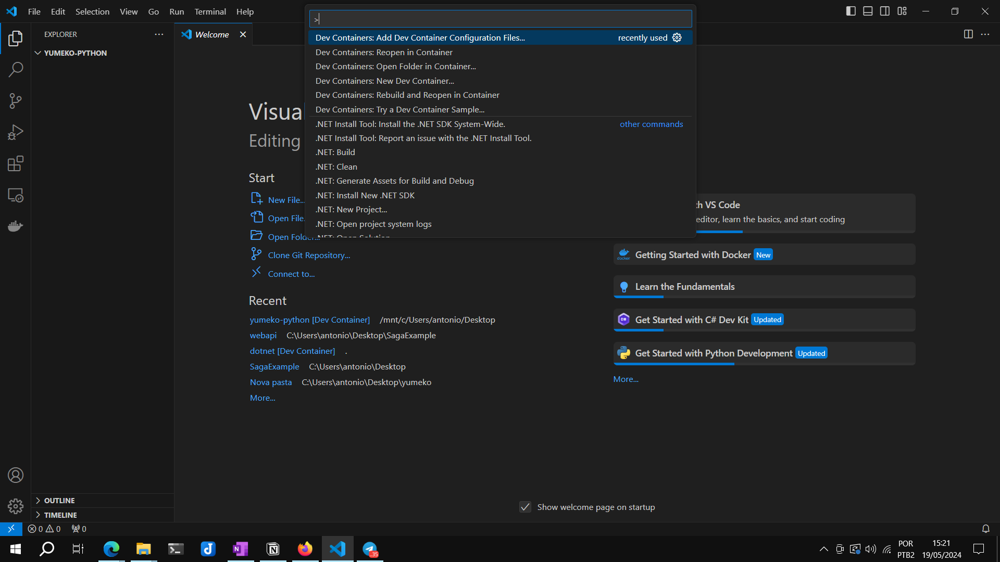
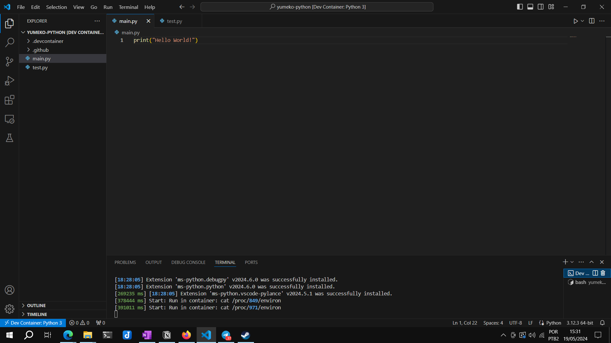

## Em busca do ambiente dev perfeito #0

*22-05-2024*

Neste artigo (talvez vire uma série no blog), vou estar buscando demonstrar minhas pesquisas sobre ferramental de desenvolvimento de software e também a evolução de meu próprio ambiente pessoal, em busca 'da perfeição' (ou algo próximo).

Pensei neste artigo mais como uma breve apresentação ferramental, com descritivos de configuração/instalação e também opiniões pessoais. O intuito disto não é entrar a fundo nas aplicações, mas sim motivar o leitor a procurar mais sobre as que forem descritas. Este artigo parte muito da minha percepção mesmo.

Inicialmente, a ideia de melhorar e evoluir meu baú de ferramentas de desenvolvimento de software veio há alguns meses, porque percebi que era um assunto que me causava uma certa desmotivação a iniciar projetos de código novos, e um dos pontos que entendi como raiz desse problema era meu ambiente, que sinceramente estava defasado quanto a práticas mais modernas (e.g.: no fluxo de trabalho pessoal diário tinha certa aversão a usar containerização, apesar de gostar bastante do tópico, porque reconhecia que realmente para projetos simples não fazia sentido). 

Por essas e outras razões, sentia como se estivesse sempre lutando com o ambiente ao começar um projeto.

<div style="text-align: center;">


</div>

Na realidade, ainda não terminei este processo de reformulação, e realmente nem pretendo.

### Problema e Solução

Em um primeiro momento, quis atacar diretamente a questão do ambiente de desenvolvimento e meu déficit no uso de containerização e para tal, estava buscando uma ferramenta que pudesse simplificar a separação de ambientes e que fizesse uso de containers. Além disso, queria algo que fosse facilmente replicável entre máquinas. Usar containers seria ideal, para desenvolvimento, porém apesar do docker-compose (por exemplo) ser simples, as vezes sinto falta algo 'auto-gerado'. Mandatoriamente, desejava algo que fosse independente da linguagem e do SO (Windows e Linux no meu caso. Algo que operasse dessa forma em Android seria sonhar alto demais), algo que deixasse o sistema 'limpo' após o uso também mas que se integrasse bem com as demais ferramentas, além do desejável de ter um setup simples e usabilidade igualmente simples. 

Tendo isto em mente, de início, estava pensando em usar volumes montados em containers para projetos mais complexos, mas sendo realista, achei que ainda assim seria trabalhoso e que talvez ocasionasse desvio do fluxo de trabalho pretendido em algum momento.

Comecei a pesquisar sobre, até que finalmente descobri que a Microsoft esteve desenvolvendo uma ferramenta (na realidade uma especificação), chamado devcontainers, que já se integrava com o VSCode (meu editor de escolha) e já parecia uma ferramenta de extensão bastante consolidada. E indo mais a fundo, percebi que realmente estava. 

Devcontainers são uma simplificação de um ambiente containerizado, mais voltado à etapa de construção do software e integrada à ferramenta de desenvolvimento em questão. A ideia aqui é ter um ambiente de desenvolvimento tão próximo de produção quanto possível.

Na prática, ele permite utilizar um arquivo json para replicar a configuração do ambiente de desenvolvimento a ser usado pelo desenvolvedor (para um caso exemplo, na sua própria máquina) e tendo a extensão certa, esta ferramenta já possui opções de geração desta configuração via interface gráfica no VSCode.

Vale citar também que por ser uma especificação, devcontainers não são exclusivos do VSCode. Uma descrição mais formal pode ser encontrada em: [Overview (containers.dev) ](https://containers.dev/overview). 

Para o meu caso de uso parecia bom demais. E realmente era isto.

### Instalação

Tendo decidido por experimentar os devcontainers, o próximo passo era fazer a instalação, e nisto, fui surpreendido pela simplicidade.

A começar, era necessário um ambiente docker para dar suporte à aplicação, neste caso optei por usar o docker no WSL, que já tinha instalado na minha máquina. O WSL pode ser instalado pela Microsoft Store (há pouca diferença entre as distros disponibilizadas, mas prefiro Ubuntu). 

Já o docker possui várias opções para instalação, porém pessoalmente prefiro a instalação dentro do WSL, onde basta replicar os passos da instalação para Ubuntu.

Após isso, bastou instalar a extensão Dev Containers no VSCode [Dev Containers - Visual Studio Marketplace](https://marketplace.visualstudio.com/items?itemName=ms-vscode-remote.remote-containers). Tendo instalado, precisei apontar para o docker no WSL da minha máquina. A configuração que alterei no VSCode foi a seguinte (caminho file > preferences > settings):

```json
{
    [...]
    "dev.containers.executeInWSL": true,
    "dev.containers.dockerPath": "/usr/bin/docker"
}
```

Um ponto já interessante é que poderia ter apontado para qualquer instância docker que tivesse acesso e a extensão a utilizaria para o setup dos ambientes. Poderia ser por exemplo, num servidor remoto com maiores capacidades. 

Ainda sobre as configurações, é possível também escolher extensões preexistentes no VSCode que serão replicadas por padrão em todos ambiente de desenvolvimento criados com devcontainers.

### Exemplo

Agora partindo para um exemplo prático de uso, em um projeto pessoal que estava para construir e também demonstrando o fluxo de trabalho com devcontainers que adotei por padrão:


- Abrir o VSCode na pasta do projeto;
- Crie o configuration file do devcontainer (F1 > Dev Containers: Add Dev Container Configuration Files);



- Escolha as features para o container através do menu do VSCode;
- A seguir, com as configurações prontas, use a opção rebuild and reopen in container (F1 > Dev Containers: rebuild and reopen in container);
- Aguarde o devcontainer subir. A primeira execução costuma ser sempre mais demorada;



Percebi que este fluxo funciona bem assim. A documentação do VSCode cita outros casos, percebi que é um fluxo que 'dá menos problema'. Quando testei algumas alternativas presentes na documentação, tive alguns erros exóticos, pra dizer o mínimo (por exemplo, ele não conseguia criar uma ambiente mesmo com a configuração estando ok, e falhava com um erro que não deixava muitos logs). Recomendo uma olhada nas referências pois citei alguns artigos e posts que me ajudaram nesse período.


### Pontos positivos e negativos observados

Considerando o problema que desejava sanar, minha opinião é que os devcontainers cumprem muito bem seu papel e sua extensão para o VSCode é de boa qualidade, mesmo ainda estando em seus primórdios.

Além disso, mesmo sendo um ferramental relativamente novo, achei uma quantidade grande de material de estudo. O próprio canal da Microsoft no youtube também possui alguns materiais demonstrativos interessantes. Especialmente pra quem pretender fazer um uso mais 'como usuário geral', imagino que irá gostar da ferramenta.

Porém, já entrando nos pontos negativos, digo não ser vantagem grande substituir ainda o fluxo de desenvolvimento com ambiente local, sobretudo para projetos simples, o famoso 'só um scriptzinho'. Para estes, ainda vejo valor em usar local.

Também, já com algumas semanas de uso, percebi uma certa quebra de protocolo de minha parte, pois algumas vezes preferia usar o ferramental de código da própria máquina mesmo ao invés de criar um devcontainer. Atribuo isto não a ferramenta mas ao costume mesmo, preciso fortalecer este hábito. Entendo estar ainda em 'período de adaptação'

O fato dele por default não sincronizar os arquivos com a pasta também me deixou um tanto quanto preocupado com possível perda de artefatos (mesmo que por debaixo dos panos use o git). Há formas de se alcançar isto, porém não encontrei nenhuma que fosse 'totalmente transparente' para o fluxo de trabalho. 

Dito isto, um dos fluxos de trabalho citado na documentação do VSCode dita como alcançar isto com alguns passos 'a mais', além de ter algum overhead nas operações de disco: https://code.visualstudio.com/docs/devcontainers/containers#_quick-start-open-an-existing-folder-in-a-container . Quando passei a seguir o fluxo que citei no caso exemplo, teoricamente resolvi isto, porém entendo que manteve o overhead das operações em disco.

Não uma desvantagem em si, mas um ponto a ser citado, é que minha recomendação de uso considera um cenário para um usuário que já possui vivência com containerização.

Vale citar que como depende do docker e WSL, é ideal ter uma máquina razoável para executar esta ferramenta.

Seguindo, o tempo de criação do devcontainer também foi perceptivo (vejo que muitos exemplos também citam isto como um problema), mas não me incomodou tanto.

Outro ponto de incômodo que tive foi que não necessariamente sanou por completo a questão de ter de escrever o docker-compose (ou arquivo de configuração do ambiente, por assim dizer), mas pra maior parte, resolveu pra mim. É notável o nível de automação que a extensão do VSCode já possui nativamente.

E falando no VSCode, para fechar, o fato dele integrar bem com o editor é também notável (por ser uma extensão da própria MS era esperado), porém mesmo que fosse meu editor de escolha, para outras IDEs entendi que ia necessitar de uma ferramenta análoga. Também queria validar se existia algo que proporcionasse a mesma funcionalidade com uma apresentação gráfica diferente.

Notando novamente que os devcontainers eram uma esspecificação e não são exclusivos do VSCode, estive pesquisando ao longo das últimas semanas e encontrei uma alternativa com bastante potencial que ainda estou validando, a ferramenta devpod (https://devpod.sh/).

Este fica pra um futuro post...


### Referências

https://stackoverflow.com/questions/67432836/can-my-docker-instance-update-as-i-develop-locally

https://firehydrant.com/blog/develop-a-go-app-with-docker-compose/

https://www.freecodecamp.org/portuguese/news/como-habilitar-o-live-reload-em-aplicacoes-do-docker-utilizando-volumes/

https://blog.logrocket.com/using-dev-containers-vs-code-easier-dev-setup/

https://www.heissenberger.at/en/blog/devcontainer-forward-ports-composer/

https://github.com/microsoft/vscode-remote-release/issues/6470

https://www.tecracer.com/blog/2023/01/devcontainers-on-windows-without-docker-for-desktop.html

https://www.daytona.io/dotfiles/ultimate-guide-to-dev-containers

https://benmatselby.dev/post/vscode-dev-containers/

https://github.com/manekinekko/awesome-devcontainers

https://code.visualstudio.com/docs/devcontainers/tips-and-tricks

https://stackoverflow.com/questions/69688517/how-to-semi-automatically-sync-local-files-with-remote-devcontainer

https://github.com/microsoft/vscode-remote-release/issues/3815